# bitter: Daemon-Side Decryption & On-the-Fly Query Refactoring Proposal

This document assesses the proposed architecture changes for `bitter`. 

---

## 1. Core Architectural Shifts

The proposal introduces a fundamental redesign of the boundaries between the **foreground CLI client** and the **background agent daemon**:

```mermaid
sequenceDiagram
    autonumber
    actor User
    participant CLI as CLI (bitter)
    participant DB as SQLite (vault.db)
    participant Daemon as Daemon (bitter start)
    participant Server as Bitwarden Server

    rect rgb(20, 20, 20)
    Note over User,Server: Passwordless Sync Command
    User->>CLI: bitter sync
    CLI->>Server: GET /sync (using stored access token)
    Server-->>CLI: Encrypted Ciphers
    CLI->>DB: Save Encrypted Ciphers
    CLI->>Daemon: Send Reload Signal
    Daemon->>DB: Reload cached metadata (if active)
    end

    rect rgb(30, 30, 30)
    Note over User,Server: Unlock Command (Derived Keys Only)
    User->>CLI: bitter unlock
    CLI->>CLI: Prompt Master Password & derive keys
    CLI->>Daemon: Send enc_key & mac_key (UNIX socket)
    Note over Daemon: Keys stored in-memory
    Daemon-->>CLI: Success Status
    end

    rect rgb(20, 20, 20)
    Note over User,Server: On-the-Fly SSH Agent Request
    User->>Daemon: SSH Agent Connection (ssh-add -l or ssh request)
    Daemon->>DB: Query encrypted SSH key ciphers
    DB-->>Daemon: Encrypted key payload
    Daemon->>Daemon: Decrypt cipher using keys in-memory
    Daemon-->>User: Perform signature or list identities
    end
```

---

## 2. Assessment of Proposed Changes

### **1. Redesigning `sync` to be Passwordless**
* **Current Behavior:** Syncing requires the user's master password (unless timeout is `"never"`) because the CLI decrypts ciphers locally and pushes the decrypted keys to the daemon.
* **Proposed Behavior:** The CLI simply downloads the encrypted sync payload from the server, updates the SQLite tables in `vault.db`, and notifies the daemon to reload metadata.
* **Pros:**
  * **Zero User Friction:** Syncing becomes a silent, automatic, passwordless operation that can be run safely as a background cron job.
  * **Simpler Command Code:** Removes all KDF derivation, prompting, and decrypting boilerplate from the `sync` subcommand.
* **Cons:** None. This is a massive improvement.

### **2. Redesigning `unlock` to pass only Keys**
* **Current Behavior:** `unlock` prompts for the password, derives the keys, performs sync, decrypts all keys, and sends the array of plaintext SSH keys to the daemon.
* **Proposed Behavior:** `unlock` only prompts for password, derives `enc_key` and `mac_key`, and passes the keys to the daemon. If the timeout is set to `"never"`, `unlock` reads the keys from the database and sends them to the daemon (or the daemon loads them at boot).
* **Pros:**
  * **Reduced Payload Size:** Only 64 bytes of keys are transmitted over the Unix domain socket.
  * **Clean Separation of Concerns:** The CLI's sole cryptographic role is key derivation (turning master password into master key). All decryption is offloaded to the daemon.

### **3. Offloading Decryption to the Daemon (On-the-Fly Queries)**
* **Current Behavior:** The daemon stores all decrypted private keys in memory as an array of `PrivateKey` structures.
* **Proposed Behavior:** The daemon stores **only the decryption keys** (`enc_key` and `mac_key`) in memory. When a client initiates an SSH connection (signature request):
  1. The daemon queries `ciphers` from the SQLite database.
  2. The daemon decrypts the target cipher on-the-fly.
  3. The daemon performs the signing operation.
  4. The decrypted private key is immediately zeroized and discarded from memory.
* **Pros:**
  * **Significant Security Hardening:** Decrypted private keys are never stored in memory long-term. Even if a process memory dump is performed, only the 64-byte key material can be compromised (which is isolated in the daemon process).
  * **Instant Synchronization:** Modifying or deleting keys in the web vault immediately affects the SSH agent after running `sync`—without needing to rebuild the daemon's in-memory keyring.
  * **Low Memory Footprint:** The daemon is incredibly lightweight.
* **Cons (Mitigated):**
  * **Performance:** Querying SQLite and decrypting a single cipher on-the-fly takes $< 1$ millisecond. Compared to network handshakes in SSH connections, this delay is completely unnoticeable.
  * **Access to DB:** The daemon must maintain access to the SQLite file. This is already true as the daemon monitors sync signals.

---

## 3. Recommended Implementation Plan

When we proceed to the implementation, we can follow these steps:

1. **Database Schema Extension:** Keep the `ciphers` and session tables as they are.
2. **Refactor `handle_sync`:**
   * Remove KDF prompts.
   * Query `/sync` using the access token.
   * Write encrypted response to SQLite.
   * Send `ControlRequest::Reload` to the daemon via the socket.
3. **Refactor Daemon Socket Protocol:**
   * Replace `ControlRequest::Unlock { keys: Vec<SshKeyData>, ... }` with `ControlRequest::Unlock { enc_key: String, mac_key: String }`.
4. **Refactor Daemon Signature Handlers:**
   * Inside the SSH agent task, when handling `SSH2_AGENTC_REQUEST_IDENTITIES`, query the SQLite database for SSH ciphers, decrypt their **public** keys, and return the list.
   * When handling `SSH2_AGENTC_SIGN_REQUEST`, query the SQLite database for the target cipher matching the public key hash, decrypt the **private** key in memory, sign the payload, and zeroize the private key.
