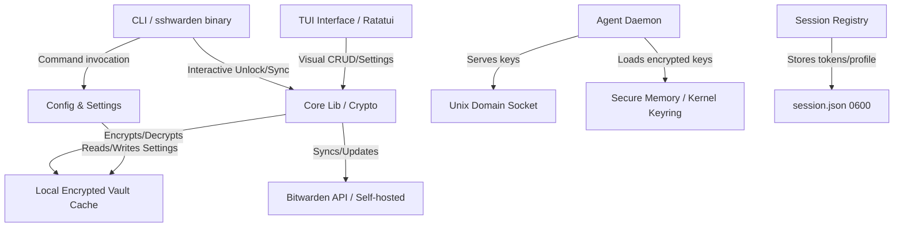

# sshwarden: Headless Bitwarden SSH Agent & Terminal Vault Client

`sshwarden` is a headless, server-friendly Bitwarden client implemented in Rust that acts as a local SSH agent and terminal vault client. It allows users to securely use SSH keys stored in their Bitwarden vaults on headless Linux servers without requiring the official graphical Bitwarden Desktop client, while providing a full terminal interface for vault interaction.

---

## 1. Project Goals & Scope

### In-Scope
- **Headless SSH Agent Daemon**: Listens on a Unix domain socket and serves SSH keys to SSH clients.
- **Bitwarden Synchronization**: Connects to Bitwarden (official or self-hosted like Vaultwarden), downloads vault items, filters out SSH keys for the agent, and caches them in a secure local database.
- **Session/Profile Separation**: Stores user credentials and access tokens separately from application settings to allow safe dotfiles sharing.
- **Flexible Authentication**: Supports Personal API Keys (`client_id` + `client_secret`), traditional Email + Password, SSO (OAuth callback), and Device Approval (Push Notifications on another device).
- **Custom Servers**: Full support for self-hosted instances (e.g., Vaultwarden).
- **Session Security**:
  - Configurable session timeout (immediately, 1m, 5m, 15m, 30m, 1h, 4h, on logout, never, custom).
  - Timeout actions: `lock` (requires master password to decrypt vault) and `logout` (wipes credentials and cache).
- **Interactive TUI (Terminal User Interface)**:
  - Interactive, keyboard-driven dashboard using `ratatui`.
  - Vault search, fuzzy filtering, item detail viewing, folder management, and full CRUD (Create, Read, Update, Delete) vault item management.
  - Secure clipboards with automatic memory cleanup.
- **Multi-Vault & Organization Support**: Access and manage personal vaults alongside organization collection vaults.
- **Target Platform**: Linux (x86_64 and AArch64) and macOS.

### Out-of-Scope
- Desktop Graphical User Interface (GUI) like Electron.
- Integrations with OS keychains (e.g., Apple Keychain or GNOME Keyring) to maintain independent command-line self-containment.

---

## 2. Architecture & Design

### High-Level Components

### Module Structure (Rust Crate)

A single cargo crate with clear module separation:
- `src/main.rs`: Entry point, runs CLI command routing and boots TUI if launched in interactive mode.
- `src/cli.rs`: CLI definition using `clap`. Defines all subcommands (`login`, `logout`, `sync`, `settings`, `keys`, `daemon`, `status`).
- `src/api/`: Bitwarden REST API client (authentication, syncing, editing ciphers, and notification hub).
- `src/crypto/`: Vault cryptography (KDF generation, Master Key derivation, AES-256-CBC/GCM decryption of Bitwarden payloads, local cache encryption).
- `src/storage/`: Manages configuration files (`config.toml`), session credentials (`session.json`), and local cache databases (`vault.db`).
- `src/agent/`: SSH agent socket listener, protocol parsing, and key serving.
- `src/daemon/`: Daemonization helper, process life-cycle, background timeout monitoring, and active user session checks.
- `src/tui/`: Full TUI implementation using `ratatui` and `crossterm` (forms, lists, fuzzy finders, folders, collections, settings).

---

## 3. Detailed Component Designs

### A. Authentication & Cryptography
To interact with Bitwarden, `sshwarden` implements the client-side cryptographic standard of Bitwarden:
1. **Key Derivation (KDF)**:
   - On login, fetch the user's KDF settings (PBKDF2 or Argon2id) from the API using their email.
   - Derives the **Master Key** using the password, salt (email), and KDF parameters.
   - Derives the **Master Key Hash** (sent to the server for authentication).
2. **Session Key & Token**:
   - Authenticates via password, API key, SSO, or device approval.
   - Receives the Identity JWT access token and refresh token.
3. **Local Cache Encryption**:
   - The synced SSH keys and generic ciphers are encrypted locally using a key derived from the user's master password (using Argon2id with a locally generated salt).

### B. Storage Design (Session vs Config)
All files are stored according to the XDG Base Directory Specification:
- **Configuration (`~/.config/sshwarden/config.toml`)**: Contains server URL, KDF parameters, username, timeout configurations, and custom socket paths. Contains no secrets.
- **Session Credentials (`~/.config/sshwarden/session.json`)**: Contains `email`, `device_id`, `access_token`, and `refresh_token`. Initialized with strict `0600` owner permissions.
- **Encrypted Cache (`~/.cache/sshwarden/vault.db`)**: Contains synced SSH key ciphers and general credentials encrypted using the local DB key.
- **Socket Path**: `~/.cache/sshwarden/ssh-agent.sock` (and control socket at `.control`).

### C. SSH Agent Daemon & TTY Hijacking
The SSH agent runs as a background daemon process.
- **Protocol**: Implements the standard SSH Agent Protocol over a Unix socket.
- **TTY Hijacking**: If a client requests a signature and the agent is locked, the agent reads the client process's active TTY descriptor (`/proc/<pid>/fd/0`), disables terminal echo via `libc::tcsetattr`, securely prompts for the master password, derives the Argon2 keys, and unlocks itself directly on the active client session.
- **Active User Session Check**: The daemon queries the POSIX `who` command every 30 seconds. If the user has 0 active terminal sessions for 60 consecutive seconds, the agent deletes its socket/PID files and terminates gracefully.

### D. Settings & Timeout Lifecycle
The timeout daemon keeps track of the time elapsed since the last SSH signature request or user interaction:
- **Lock Action**:
  - Wipes the decrypted SSH keys from memory.
  - Requires `sshwarden unlock` (master password input) to re-load and decrypt the local cache into memory.
- **Logout Action**:
  - Wipes decrypted SSH keys from memory.
  - Deletes `~/.cache/sshwarden/vault.db` (encrypted cache).
  - Deletes the session token file `session.json`.
  - Requires full `sshwarden login` and `sshwarden sync` to be used again.

### E. Advanced Login Methods
1. **SSO Authentication**:
   - Spin up a temporary local HTTP server on a random port (e.g. `127.0.0.1:45678`).
   - Open the browser pointing to the Bitwarden SSO page with the localhost callback as redirect URI.
   - Capture the response parameters, perform token exchanges, and terminate the server.
2. **Device Approval**:
   - Initiate a login approval request on the Bitwarden server.
   - Display the verification code on the terminal.
   - Poll the server notification endpoint until the user approves the prompt on their registered phone or other active device.

### F. Terminal User Interface (TUI)
- **Engine**: Developed using `ratatui` and `crossterm`.
- **Fuzzy Filtering**: Incorporates a fast fuzzy-matching library (e.g., `nucleo` or `fuzzy-matcher`) to filter vault ciphers instantly.
- **Safe Clipboard**: Enables copying passwords/keys to clipboard with an asynchronous background thread that automatically clears the clipboard after 20 seconds.
- **CRUD Operations**: Form-based editing for vault ciphers, folders, and custom fields.

---

## 4. SSH Key Representation in Bitwarden

Bitwarden supports SSH keys natively and via custom fields. `sshwarden` supports:
1. **Native SSH Key Items**: Bitwarden's standard SSH key type (type `100`).
2. **Secure Notes with Attachments**: Secure notes with standard names containing private keys.
3. **Login / Note Items with Custom Fields**: Items where the private key is stored in a custom field named `ssh_private_key` or similar.

---

## 5. Development Roadmap

### Phase 1: Project Setup & CLI Skeleton (Complete)
- Initialize cargo workspace.
- Setup CLI commands and arguments using `clap`.
- Implement local configuration storage (`config.toml`).

### Phase 2: Cryptography & Bitwarden API (Complete)
- Implement Bitwarden client cryptography (KDF, PBKDF2, Argon2id, Master Key derivation).
- Implement Bitwarden Login API (Password, API key auth, self-hosted endpoints).
- Implement Vault Sync API (`/sync`).
- Write CLI command `sshwarden login` and `sshwarden sync`.

### Phase 3: Secure Local Storage & Cache (Complete)
- Implement secure encryption/decryption of the local vault cache.
- Implement the filtering logic to store only SSH keys.
- Write CLI command `sshwarden keys list/add/delete/edit` to manipulate vault ciphers.

### Phase 4: SSH Agent Protocol & Unix Socket (Complete)
- Implement SSH Agent Protocol parser.
- Create Unix domain socket listener.
- Implement signing operations with SSH private keys (RSA, Ed25519, ECDSA).
- Implement daemonization of the agent process (`daemonize` crate).

### Phase 5: Session Timeout & Security Hardening (Complete)
- Implement background timeout monitoring in the daemon.
- Implement TTY-hijacking for terminal unlock prompts.
- Implement active user session monitoring (auto-quit on zero sessions).
- Implement lock and logout behaviors.

### Phase 6: WebSocket Live Sync (Complete)
- Implement SignalR protocol negotiation.
- Build WebSocket event listener task in the daemon.
- Implement incremental cipher details fetching and merging.

### Phase 7: Testing & Packaging (Complete)
- Unit tests for KDF and cipher decryption.
- Verify agent socket integration with standard OpenSSH clients.
- Add statically linked musl target packaging.

### Phase 8: User Profile & Session Isolation (Complete)
- Extract session variables from `config.toml`.
- Create `session.json` storage with strict `0600` permissions.
- Update `storage` layer and CLI handlers to utilize the decoupled files.

### Phase 9: API Key, SSO, and Device Push Login (Planned)
- Implement API Key Login flow.
- Add local callback HTTP server for OAuth SSO flow.
- Implement Device Push Approval polling.

### Phase 10: TUI Dashboard & CRUD (Planned)
- Integrate `ratatui` and `crossterm`.
- Design fuzzy-searchable list view, item details screen, and form editors.
- Implement folder creation, folder editing, and folder assignment.
- Build secure clipboard clearers and automatic lock overlay tasks.

### Phase 11: Multi-Vault Organization Support (Planned)
- Extend `storage` database to support collections and multiple organization vaults.
- Implement decryption of organization ciphers using decrypted organization keys.
- Add organization filter options in TUI and CLI views.

---

## 6. Recommended Rust Dependency Crates

| Crate | Purpose |
|---|---|
| `clap` | Command-line argument parsing |
| `tokio` | Async runtime for daemon socket and requests |
| `reqwest` | HTTP client for Bitwarden API |
| `serde` & `serde_json` | JSON serialization and deserialization |
| `ring` & `pbkdf2` & `argon2` | Cryptographic primitives and KDFs |
| `aes` & `cbc` & `gcm` | Symmetric encryption for ciphers and local cache |
| `ssh-agent-lib` | SSH Agent protocol implementation |
| `ssh-key` | Decoding and encoding SSH private/public keys |
| `zeroize` | Securely clearing keys from memory |
| `dirs` | Standard XDG directory lookup |
| `daemonize` | Daemonizing the SSH agent process on Linux |
| `tokio-tungstenite` | WebSocket client for live sync notifications |
| `ratatui` | Modern engine for building terminal user interfaces (TUI) |
| `crossterm` | Cross-platform terminal raw mode manipulation |
| `fuzzy-matcher` | High performance fuzzy-matching for TUI lists |
| `copypasta` | Clipboard interaction for TUI copying |
| `tiny_http` | Tiny HTTP server for capturing SSO OAuth callback redirects |

---

## 7. Architectural Guidelines & Coding Standards

### A. Code Standards & Style
- **Rust Style Guide**: Follow the official Rust Style Guide.
- **Formatting**: Run `cargo fmt` to enforce uniform code styling.
- **Safety Comments**: Every `unsafe` block must include a preceding `// SAFETY:` comment justifying its correctness and safety boundaries.

### B. Modularization & Decoupling
- **Decoupled Components**: Keep the cryptography, database storage, and SSH agent logic decoupled. TUI views should strictly follow an Elm-like Model-View-Update (MVU) pattern to keep logic separate from render layouts.
- **Security Invariance**: Raw master passwords or intermediate derived keys must never be logged or persist to disk under non-never timeout configurations.
