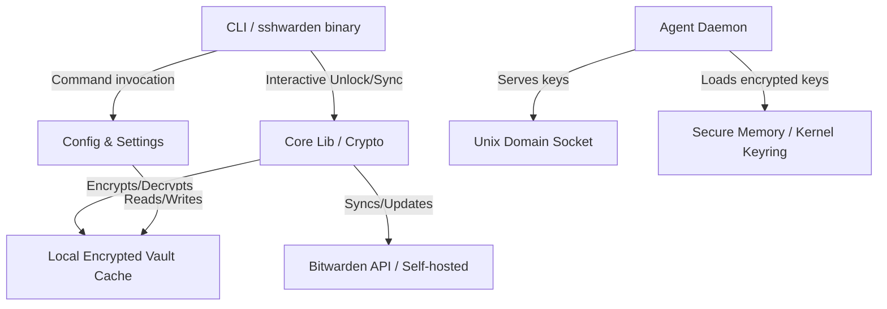

# sshwarden: Headless Bitwarden SSH Agent Client

`sshwarden` is a headless, server-friendly Bitwarden client implemented in Rust that acts as a local SSH agent. It allows users to securely use SSH keys stored in their Bitwarden vaults on headless Linux servers without requiring the official graphical Bitwarden Desktop client.

---

## 1. Project Goals & Scope

### In-Scope
- **Headless SSH Agent Daemon**: Listens on a Unix domain socket and serves SSH keys to SSH clients.
- **Bitwarden Synchronization**: Connects to Bitwarden (official or self-hosted like Vaultwarden), downloads vault items, filters out everything except SSH keys, and stores them in a secure local cache.
- **Credential Management**: Commands to list, add/create, edit, and delete SSH keys within the Bitwarden vault.
- **Flexible Authentication**: Supports Personal API Keys (`client_id` + `client_secret`) and traditional Email + Password logins. (SSO is deferred for future implementation).
- **Custom Servers**: Full support for self-hosted instances (e.g., Vaultwarden).
- **Session Security**:
  - Configurable session timeout (immediately, 1m, 5m, 15m, 30m, 1h, 4h, on logout, never, custom).
  - Timeout actions: `lock` (requires master password to decrypt vault) and `logout` (wipes credentials and cache).
- **Target Platform**: Linux (x86_64 and AArch64).

### Out-of-Scope
- Graphic User Interface (GUI).
- General password/credentials management (non-SSH items).
- Non-Linux OS support (initial release target is strictly Linux).

### Future Work / Deferred Features
- **SSO Authentication**: Supporting single-sign-on (SSO) authentication.
- **TUI Configuration Interface**: A Terminal User Interface (TUI) for interactive, guided configuration of sshwarden settings directly in a headless terminal, to be implemented after the core features are stable.

---

## 2. Architecture & Design

### High-Level Components

### Module Structure (Rust Crate)

A single cargo crate with clear module separation:
- `src/main.rs`: Entry point, runs CLI command routing.
- `src/cli.rs`: CLI definition using `clap`. Defines all subcommands (`login`, `logout`, `sync`, `settings`, `keys`, `daemon`).
- `src/api/`: Bitwarden REST API client (authentication, syncing, editing ciphers).
- `src/crypto/`: Vault cryptography (KDF generation, Master Key derivation, AES-256-CBC/GCM decryption of Bitwarden payloads, local cache encryption).
- `src/storage/`: Manages configuration files, cache storage (`~/.config/sshwarden/` and `~/.cache/sshwarden/`).
- `src/agent/`: SSH agent socket listener, protocol parsing, and key serving.
- `src/daemon/`: Daemonization helper, process life-cycle, background timeout monitoring.
- `src/keyring/`: Interfacing with the Linux Kernel Keyring (`keyutils`) to store keys/passphrases securely in memory.

---

## 3. Detailed Component Designs

### A. Authentication & Cryptography
To interact with Bitwarden, `sshwarden` must implement the client-side cryptographic standard of Bitwarden:
1. **Key Derivation (KDF)**:
   - On login, fetch the user's KDF settings (PBKDF2 or Argon2id) from the API using their email.
   - Derives the **Master Key** using the password, salt (email), and KDF parameters.
   - Derives the **Master Key Hash** (sent to the server for authentication).
2. **Session Key & Token**:
   - Authenticate via API key (`client_id` + `client_secret`) or email/password.
   - Receive the Identity JWT access token.
3. **Local Cache Encryption**:
   - The synced SSH keys are encrypted locally using a key derived from the user's master password (using Argon2id with a locally generated salt).
   - This ensures that if the machine is powered off, the keys cannot be retrieved without the master password.

### B. Storage Design
All files are stored according to the XDG Base Directory Specification:
- **Configuration**: `~/.config/sshwarden/config.toml` (contains API server URL, KDF parameters, username, timeout configurations, and path to socket).
- **Encrypted Cache**: `~/.cache/sshwarden/vault.db` (contains synced SSH key ciphers encrypted using local key).
- **Socket Path**: `~/.run/sshwarden.sock` (or `/tmp/sshwarden_<uid>.sock`).

### C. SSH Agent Daemon
The SSH agent runs as a background daemon process.
- **Protocol**: Implements the standard SSH Agent Protocol over a Unix socket.
- **Memory Security**:
  - The daemon holds the decrypted private keys in memory.
  - On `lock` (due to timeout or manual command), the decrypted keys are securely wiped from memory (`zeroize` crate).
  - The daemon uses the Linux Kernel Keyring (`keyctl`) or protected memory pages (`mlock`) to prevent keys from being swapped to disk or read by other users.
- **Interactive Unlock**: If a client requests a signature and the agent is locked, the agent will fail the request. The user can run `sshwarden unlock` from another terminal to provide the master password, which unlocks the daemon.

### D. Settings & Timeout Lifecycle
The timeout daemon keeps track of the time elapsed since the last SSH signature request or user interaction:
- **Lock Action**:
  - Wipes the decrypted SSH keys from memory.
  - Requires `sshwarden unlock` (master password input) to re-load and decrypt the local cache into memory.
- **Logout Action**:
  - Wipes decrypted SSH keys from memory.
  - Deletes `~/.cache/sshwarden/vault.db` (encrypted cache).
  - Deletes the identity tokens from config.
  - Requires full `sshwarden login` and `sshwarden sync` to be used again.

### E. Real-time Live Sync (WebSocket & SignalR Hub)
To keep the local vault cache up-to-date without continuously pulling the entire vault (via `/sync`), `sshwarden` evaluates and implements real-time notifications:
1. **Feasibility**:
   - Both the official Bitwarden server and Vaultwarden support a notification hub.
   - **Bitwarden Official**: Uses ASP.NET Core SignalR JSON protocol over WebSockets on the `/notifications/hub` endpoint.
   - **Vaultwarden**: Standard WebSocket connections on the same `/notifications/hub` endpoint (integrated directly on Rocket in modern versions).
   - This makes implementing a unified real-time websocket consumer in Rust highly feasible.
2. **Connection Lifecycle**:
   - On startup, the daemon initiates a negotiation request (`POST /api/notifications/hub/negotiate`) using the JWT access token to get a connection ID.
   - It establishes a WebSocket connection to `wss://<server>/notifications/hub?access_token=<token>`.
   - If connected to an official Bitwarden server, it sends the SignalR protocol handshake message: `{"protocol":"json","version":1}0x1E` (where `0x1E` is the record separator).
   - Keeps the connection alive using standard WebSocket/SignalR ping/pong frames.
3. **Payload Handling**:
   - The daemon listens for `ReceiveUpdate` target events.
   - When a notification arrives, it parses the payload arguments.
   - If the update type represents a **full sync** (`SyncVault`), it schedules a full `/api/sync` run.
   - If the update type is **cipher-specific** (`SyncCipherCreate`, `SyncCipherUpdate`), it reads the cipher ID (UUID) from the message and triggers a targeted fetch: `GET /api/ciphers/<id>/details`.
   - The fetched cipher is decrypted, checked to see if it contains SSH key data, and then merged/updated locally in the encrypted cache.
   - If the update type is **cipher deletion** (`SyncCipherDelete`), it deletes the corresponding cipher from the local cache.

### F. Official SDK Evaluation (Bitwarden Secrets Manager SDK)
We evaluated using the official `bitwarden` crate (available on [crates.io](https://crates.io/crates/bitwarden)):
- **Conclusion**: We will **not** use the official `bitwarden` SDK.
- **Rationale**:
  - The official SDK crate is exclusively designed and supported for **Bitwarden Secrets Manager**. It uses a machine-account access token model and does not expose standard Password Manager (Personal Vault) APIs (e.g., user email/password login, client-side KDF master key derivation, standard cipher sync `/api/sync` or decryption).
  - Standard users keep their SSH keys in their standard Password Manager vault (Logins, Secure Notes) rather than the developer-focused Secrets Manager product.
  - Relying on the official SDK would make it impossible to connect to standard personal accounts or self-hosted Vaultwarden instances.
- **Approach**: We will implement the standard Bitwarden Client REST API protocol in `src/api/` and `src/crypto/` modules directly.

---

## 4. SSH Key Representation in Bitwarden

Bitwarden supports SSH keys natively and via custom fields. `sshwarden` will support:
1. **Native SSH Key Items**: Bitwarden's standard SSH key type (type `100` or equivalent depending on API schema).
2. **Secure Notes with Attachments**: Secure notes with standard names containing private keys.
3. **Login / Note Items with Custom Fields**: Items where the private key is stored in a custom field named `ssh_private_key` or similar.

During the `sync` process, `sshwarden` iterates through the decrypted payload, extracts these SSH keys, parses them (using `ssh-key` or `openssh-keys` crates), and organizes them into its local encrypted database.

---

## 5. Development Roadmap

### Phase 1: Project Setup & CLI Skeleton
- Initialize cargo workspace.
- Setup CLI commands and arguments using `clap`.
- Implement local configuration storage (`config.toml`).

### Phase 2: Cryptography & Bitwarden API
- Implement Bitwarden client cryptography (KDF, PBKDF2, Argon2id, Master Key derivation).
- Implement Bitwarden Login API (Password, API key auth, self-hosted endpoints).
- Implement Vault Sync API (`/sync`).
- Write CLI command `sshwarden login` and `sshwarden sync`.

### Phase 3: Secure Local Storage & Cache
- Implement secure encryption/decryption of the local vault cache.
- Implement the filtering logic to store only SSH keys.
- Write CLI command `sshwarden keys list/add/delete/edit` to manipulate vault ciphers.

### Phase 4: SSH Agent Protocol & Unix Socket
- Implement SSH Agent Protocol parser.
- Create Unix domain socket listener.
- Implement signing operations with SSH private keys (RSA, Ed25519, ECDSA).
- Implement daemonization of the agent process (`daemonize` crate).

### Phase 5: Session Timeout & Security Hardening
- Implement background timeout monitoring in the daemon.
- Integrate Linux Kernel Keyring (`keyctl`) for secure passphrase storage.
- Implement memory protection (using `zeroize` and `secrecy` crates).
- Implement lock and logout behaviors.

### Phase 6: WebSocket Live Sync Implementation
- Implement the SignalR protocol negotiation and connection handshakes.
- Build the WebSocket event listener task in the daemon using `tokio-tungstenite`.
- Implement incremental cipher fetching (`GET /api/ciphers/<id>/details`) and incremental cache merging.

### Phase 7: Testing & Packaging
- Comprehensive unit tests for crypto and API mock-ups.
- Integration testing of the SSH agent with `ssh-add` and standard OpenSSH clients.
- Package as a statically linked binary for Linux.

---

## 6. Recommended Rust Dependency Crates

| Crate | Purpose |
|---|---|
| `clap` | Command-line argument parsing |
| `tokio` | Async runtime for daemon socket and requests |
| `reqwest` | HTTP client for Bitwarden API |
| `serde` & `serde_json` | JSON serialization and deserialization |
| `ring` & `pbkdf2` & `argon2` | Cryptographic primitives and KDFs |
| `aes` & `cbc` & `gcm` | Symmetric encryption for ciphers and local cache |
| `ssh-agent-lib` | SSH Agent protocol implementation |
| `ssh-key` | Decoding and encoding SSH private/public keys |
| `zeroize` | Securely clearing keys from memory |
| `dirs` | standard XDG directory lookup |
| `daemonize` | Daemonizing the SSH agent process on Linux |
| `keyutils` / `linux-keyutils` | Linux kernel keyring bindings |
| `tokio-tungstenite` | WebSocket client for live sync notifications |

---

## 7. Architectural Guidelines & Coding Standards

### A. Code Standards & Style
- **Rust Style Guide**: The codebase must strictly follow the official [Rust Style Guide](https://doc.rust-lang.org/style-guide/).
- **Formatting**: Run `cargo fmt` to enforce uniform code styling.
- **Linting**: Run `cargo clippy` and fix all warnings before merging features to ensure code quality.

### B. Modularization & Decoupling
To ensure high maintainability, reuse, and testing capability:
- **Decoupled Components**: Separate concerns clearly. For instance, the cryptography code (`crypto/`) should not depend directly on XDG filesystem directories or REST HTTP requests. Similarly, the SSH Agent protocol parsing and logic (`agent/`) must be agnostic to the database/config serialization format.
- **Reusable Utility Helpers**: Common patterns (e.g., zeroizing secrets in memory, cryptographic padding, custom error mappings) should be factored out into helper traits/modules to keep repetitive code minimal.
- **Dependency Injection**: Utilize traits for abstracting storage (e.g., a `VaultCache` trait) and HTTP request backends to enable easy unit testing and mocking.

